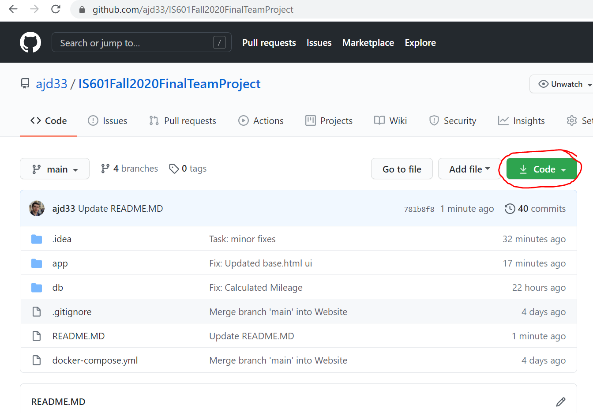
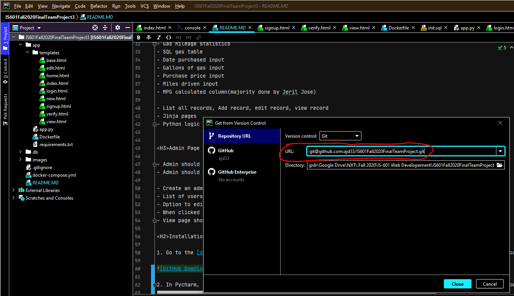
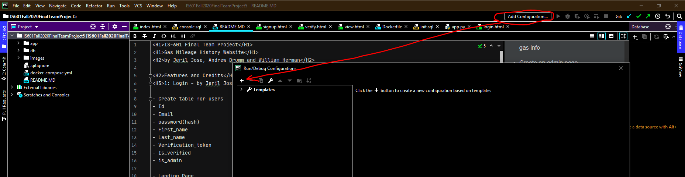
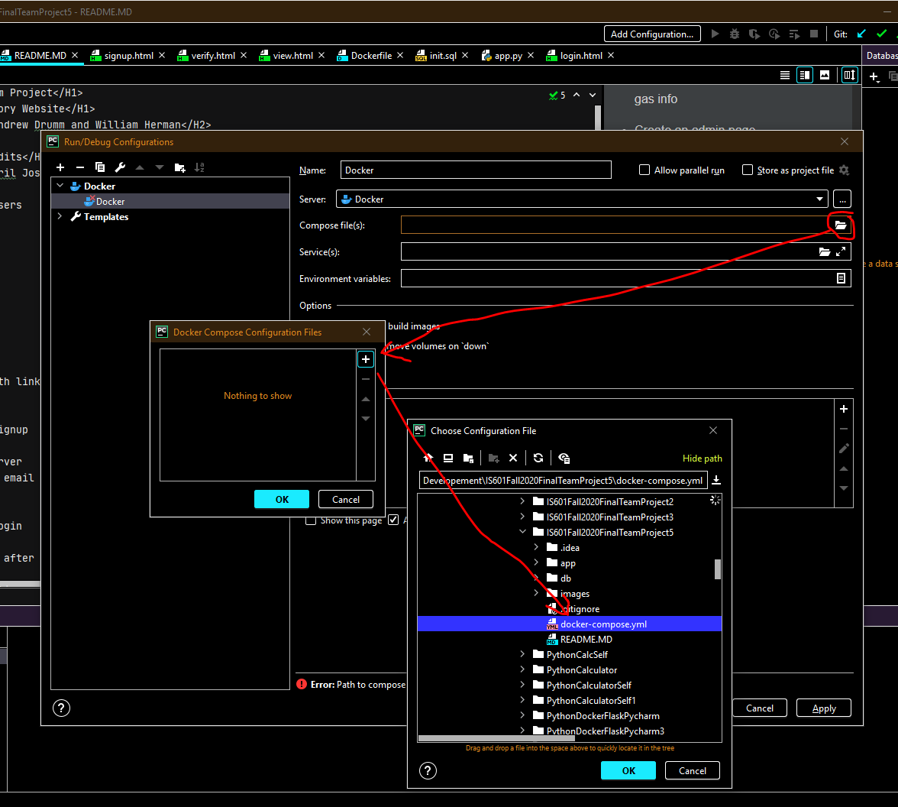
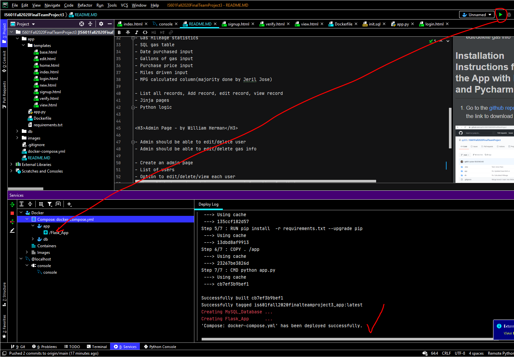
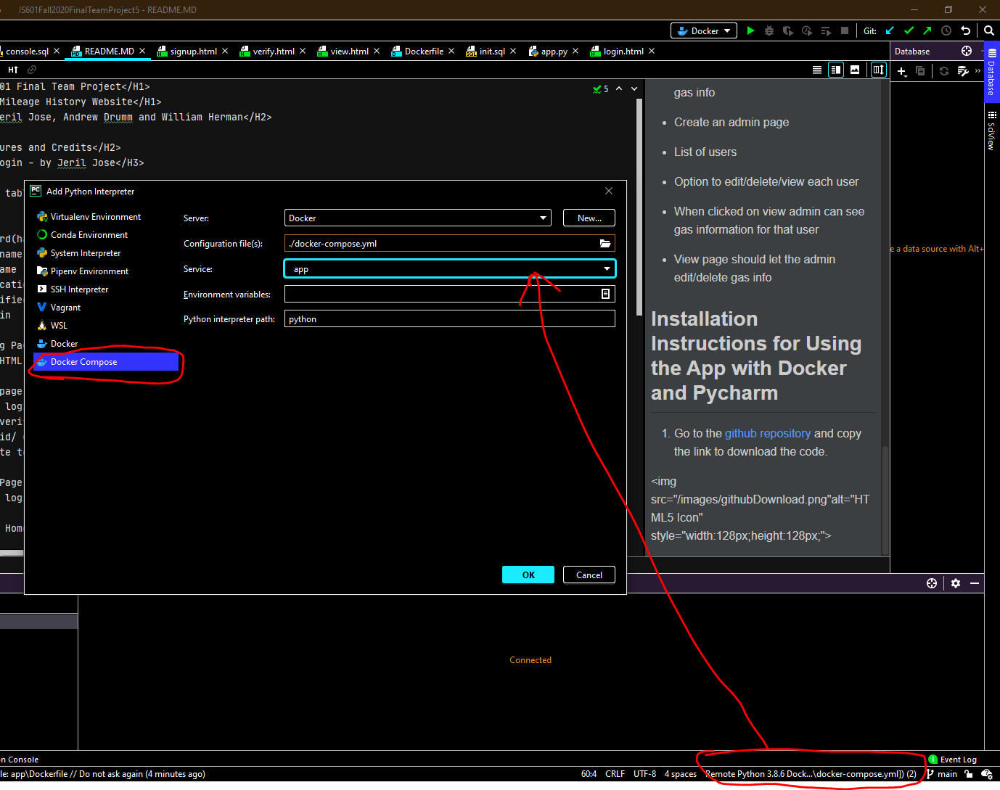
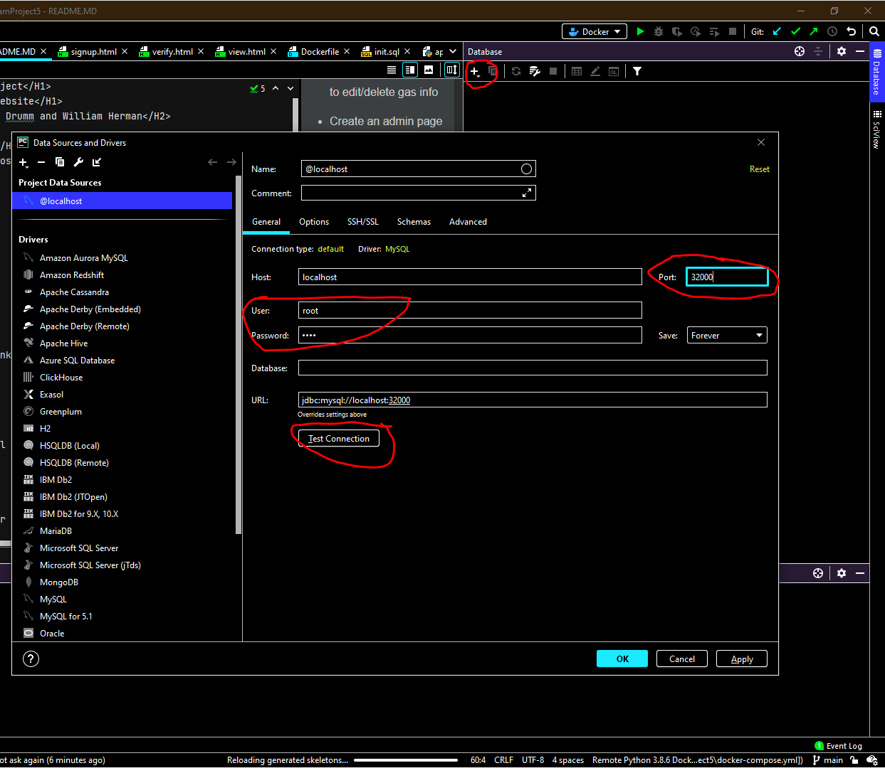
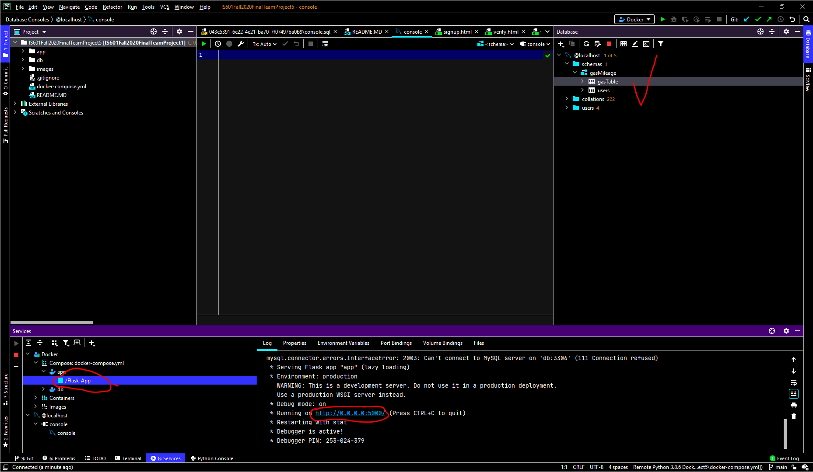
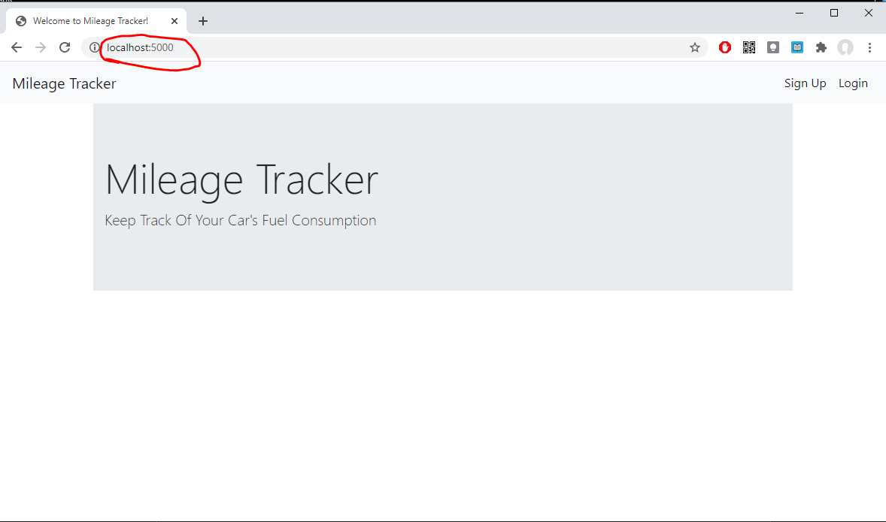

<H1>IS-601 Final Team Project</H1>
<H1>Gas Mileage History Website</H1>
<H2>by Jeril Jose, Andrew Drumm and William Herman</H2>

<H2>Features and Credits</H2>
<H3>1: Login - by Jeril Jose</H3>

- Create table for users
- Id
- Email
- password(hash)
- First_name
- Last_name
- Verification_token
- Is_verified
- is_admin

- Landing Page
- Plain HTML page with links to signup and login
- Signup
- Jinja page
- Python logic for signup
- Email verification
- Sendgrid/ gmail server
- Generate token and email the verification url to user
- Login
- Jinja Page
- Python logic for login

<H3>User Home Page - after login - by Andrew Drumm</H3>

- Gas Mileage statistics 
- SQL gas table 
- Date purchased input
- Gallons of gas input
- Purchase price input
- Miles driven input
- MPG calculated column(majority done by Jeril Jose)

- List all records, Add record, edit record, view record
- Jinja pages
- Python logic

<H3>Admin Page - by William Herman</H3>

- Admin should be able to edit/delete user
- Admin should be able to edit/delete gas info

- Create an admin page
- List of users
- Option to edit/delete/view each user
- When clicked on view admin can see gas information for that user
- View page should let the admin edit/delete gas info

<H2>Installation Instructions for Using the App with Docker and Pycharm</H2>

1. Go to the [github repository](https://github.com/ajd33/IS601Fall2020FinalTeamProject) and copy the link to download the code. 

2. In Pycharm, go to VCS in the top bar > "Get from Version Control" then past the link you copied from gitHub to download the repo to your machine. 

3. Once you have the repo downloaded, you need to add a docker configuration on the top right. Then click the + symbol and choose a docker compose file.

4. Add a compose file, choose the docker-compose.yml file in the root folder. 

5. Next, run the file by clicking the green play button. You should see that it has been deployed successfully. 

6. Add an interpreter on the bottom right. Choose docker compose, select the docker-compose.yml file then choose app on the dropdown menu. 

7. Now add a database. Plus button > DataSource > MySQL. Change the port to 32000. Change the user and password both to "root". Apply and OK. You should see the database pop up. 

8. Run the Flask_App on the bottom left. You should see the URL show up. Click on it to open. 

 
 
9. You should now be in the app in your web browser! Enjoy! If the link is broken, go to [localhost:5000](https://localhost:5000) instead. 

